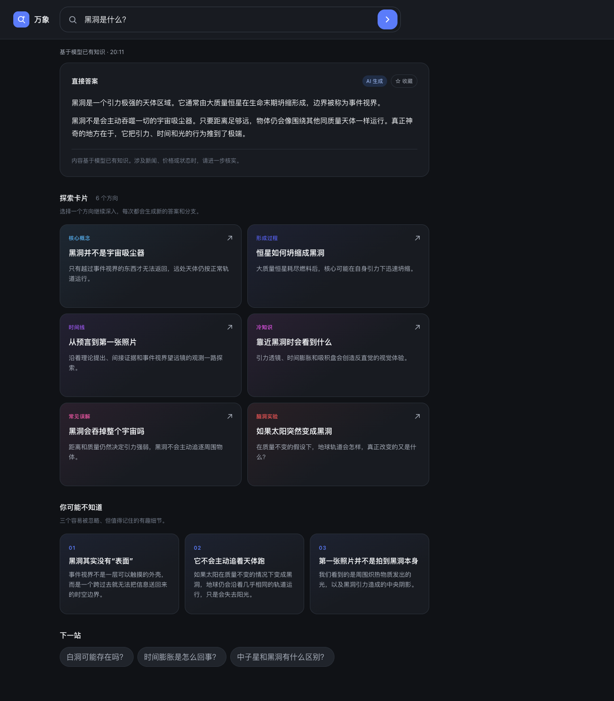

# Mosaic Explore

[简体中文](./README.zh-CN.md)

Mosaic Explore is a Cherry Studio MiniApp for turning one question into an interactive journey. It generates a streaming direct answer while concurrently preparing exploration cards, surprising facts, and related topics.

[Install from Cherry Studio](https://kangfenmao.github.io/mosaic-explore/manifest.json)




## Features

- Streams a direct AI answer while generating exploration content concurrently.
- Creates six paths, three surprising facts, and playful next topics.
- Opens a 20-topic discovery page from the home suggestions, with hourly background refreshes that appear on the next visit.
- Rotates category-balanced recommendations and avoids topics already in history when possible.
- Reopens identical searches from the local cache, with an explicit regenerate option.
- Stores up to 100 complete explorations and 12 favorites, with item-level favorite and delete actions.
- Supports contextual follow-up questions from the current answer.
- Exports an exploration as a shareable text file when the optional permission is enabled.
- Uses existing model knowledge and clearly identifies non-real-time content.

## Permissions

| Permission | Why it is needed |
| --- | --- |
| `ai.chat` | Generate the answer, exploration cards, facts, and related topics. |
| `file.load` | Load the local exploration history cache. |
| `file.save` | Save up to 100 complete exploration results locally. |
| `file.export` (optional) | Export the current exploration as a text file chosen by the user. |
| `storage.get` | Load favorites and migrate older history data. |
| `storage.set` | Save favorites. |

The MiniApp requests no network permission. AI requests are sent through Cherry Studio's configured model provider.

## Install

In Cherry Studio, install a MiniApp from this manifest URL:

```text
https://kangfenmao.github.io/mosaic-explore/manifest.json
```

Versioned `.miniapp` packages are also available from [GitHub Releases](https://github.com/kangfenmao/mosaic-explore/releases).

## Source and packaging

The package source is in [`app`](./app/). A `.miniapp` file is a zip archive with `manifest.json` at its root:

```sh
cd app
zip -X -r ../mosaic-explore.miniapp . -x '.*' -x '__MACOSX/*'
```

Pushing a new version in `app/manifest.json` to `main` runs the release workflow. It builds the package, calculates its digest and size, generates the distribution manifest, deploys everything to GitHub Pages, and creates the matching GitHub Release.

## Support

Please report bugs or request features through [GitHub Issues](https://github.com/kangfenmao/mosaic-explore/issues).

## License

[MIT](./LICENSE)
